# Installation and Run instructions
1. Enter the repository, and type `yarn`
2. to run dev: `yarn run dev`
3. to run prod: `yarn run build && yarn run deploy`

# Build and Deploy with Docker
1. run `yarn run docker`. This builds the docker image and deploys it, exposing the app on port 80.

To build the docker image, you can run `yarn run buildDocker`
and you can run `yarn run deployDocker` to deploy without building

# Running Test Suite 
1. `python3 test/run_tests.py`

```mermaid
flowchart TD
    Client["External Client"]:::external
    Server["API Server (app.ts)"]:::api
    Client -->|"HTTP_Request"| Server

    subgraph "Routes"
        Auth["Authentication Route"]:::route
        Feedback["Feedback Route"]:::route
        Flashcards["Flashcards Route"]:::route
        Noun["Noun Route"]:::route
        Root["Root Route"]:::route
        Uptime["Uptime Route"]:::route
    end

    Server --> Auth
    Server --> Feedback
    Server --> Flashcards
    Server --> Noun
    Server --> Root
    Server --> Uptime

    subgraph "Utilities"
        DBUtil["Database Utility"]:::utility
        LoggerUtil["Logger Utility"]:::utility
        SwaggerUtil["Swagger Documentation Utility"]:::utility
    end

    Server --> DBUtil
    Server --> LoggerUtil
    Server --> SwaggerUtil

    subgraph "Infrastructure"
        Docker["Docker Container"]:::infra
        CICD["CI/CD Pipeline"]:::ci
        Testing["Testing Module"]:::test
    end

    Server --- Docker
    CICD -->|"Build/PUSH"| Docker
    Testing -->|"Tests_API"| Server

    classDef external fill:#AED6F1,stroke:#1B4F72,stroke-width:2px;
    classDef api fill:#FAD7A0,stroke:#D35400,stroke-width:2px;
    classDef route fill:#A9DFBF,stroke:#1D8348,stroke-width:2px;
    classDef utility fill:#F5B7B1,stroke:#C0392B,stroke-width:2px;
    classDef infra fill:#D2B4DE,stroke:#6C3483,stroke-width:2px;
    classDef ci fill:#F7DC6F,stroke:#B7950B,stroke-width:2px;
    classDef test fill:#E8DAEF,stroke:#8E44AD,stroke-width:2px;

    click Server "https://github.com/hans-wehr-arabic-dictionary/hans-wehr-backend/blob/master/src/app.ts"
    click Auth "https://github.com/hans-wehr-arabic-dictionary/hans-wehr-backend/blob/master/src/routes/auth.ts"
    click Feedback "https://github.com/hans-wehr-arabic-dictionary/hans-wehr-backend/blob/master/src/routes/feedback.ts"
    click Flashcards "https://github.com/hans-wehr-arabic-dictionary/hans-wehr-backend/blob/master/src/routes/flashcards.ts"
    click Noun "https://github.com/hans-wehr-arabic-dictionary/hans-wehr-backend/blob/master/src/routes/noun.ts"
    click Root "https://github.com/hans-wehr-arabic-dictionary/hans-wehr-backend/blob/master/src/routes/root.ts"
    click Uptime "https://github.com/hans-wehr-arabic-dictionary/hans-wehr-backend/blob/master/src/routes/uptime.ts"
    click DBUtil "https://github.com/hans-wehr-arabic-dictionary/hans-wehr-backend/blob/master/src/utils/db.ts"
    click LoggerUtil "https://github.com/hans-wehr-arabic-dictionary/hans-wehr-backend/blob/master/src/utils/logger.ts"
    click SwaggerUtil "https://github.com/hans-wehr-arabic-dictionary/hans-wehr-backend/blob/master/src/utils/swagger-api.ts"
    click Docker "https://github.com/hans-wehr-arabic-dictionary/hans-wehr-backend/tree/master/Dockerfile"
    click CICD "https://github.com/hans-wehr-arabic-dictionary/hans-wehr-backend/blob/master/.github/workflows/build_push_docker.yml"
    click Testing "https://github.com/hans-wehr-arabic-dictionary/hans-wehr-backend/blob/master/test/run_tests.py"
```

